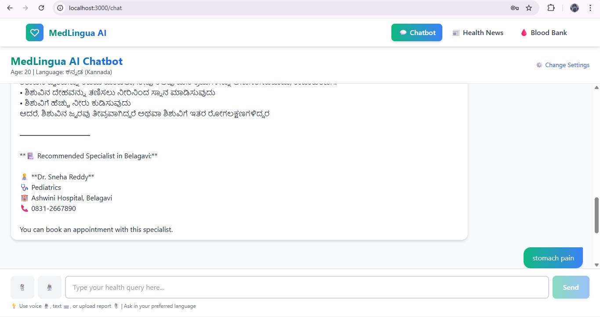
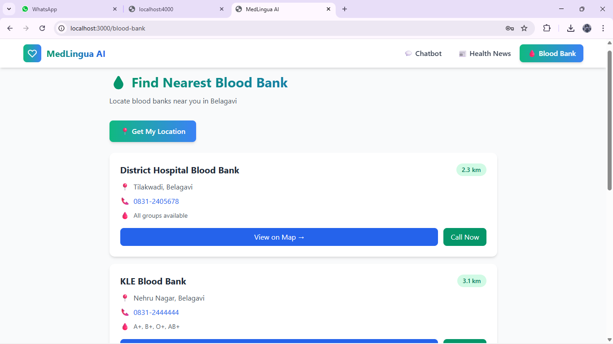
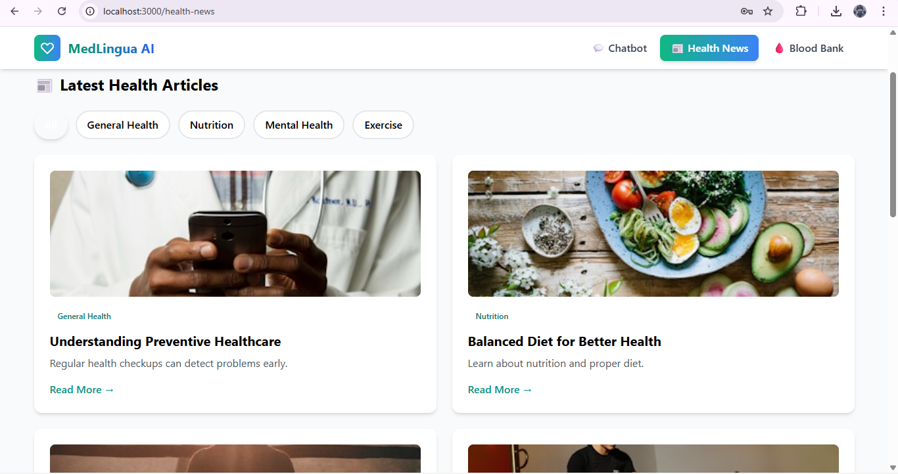

cd ~/OneDrive/Desktop/MAI_local/medlingua-ai

cat > README.md << 'EOF'
# MedLingua AI 🩺🤖

**Comprehensive AI‑powered multilingual healthcare platform offering intelligent consultations, blood bank discovery, and curated real‑time health information.**

  
  

## ✨ Features Showcase

### Language preferences setup  

### Consultation suggestions  

### 🩸 Blood bank locator  

### 📰 Health news dashboard  

### 🔐 Secure login  

## 🚀 Quick start

git clone https://github.com/shivaleela-a-ballary/MedLingua-AI.git
cd MedLingua-AI/frontend
npm install
npm run dev

## 🛠️ Tech Stack

Frontend: React 18 + Vite + Tailwind CSS

## 👤 Author
**Shivaleela A Ballary**  
3rd Year CSE | Full-stack & backend developer with a focus on Python and AI

## 📄 License

